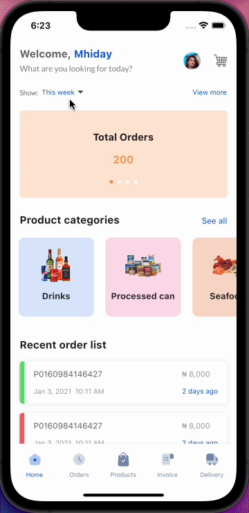
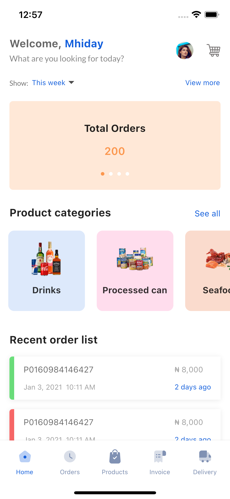
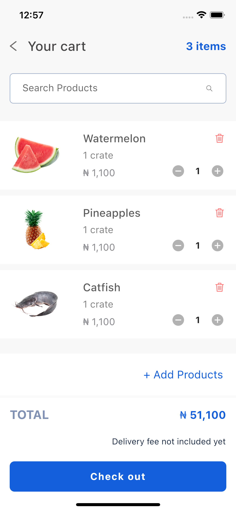
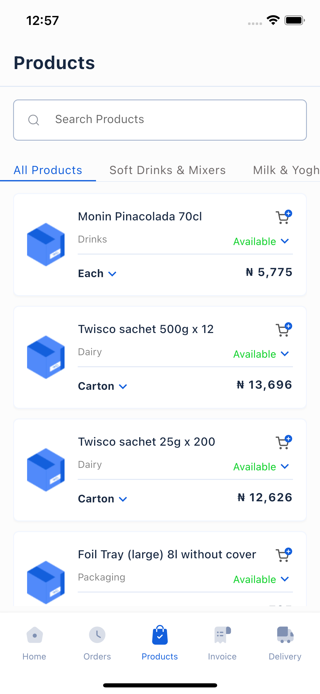

# Vendease Sample

Vendease Sample App

>SCREEN SHOTS

<table><tr>
<td style="text-align: center">

</td>
  <td style="text-align: center">
  
</td>
  <td style="text-align: center">
  
</td>
<td style="text-align: center">

</td>
  
</tr></table>

## ✨ Features
* Firebase Authentication.
* Google Places (Autocomplete search features for places).
* Provider.
* MVVM Architecture.
* SharedPreference (Persistence of location and user login state)

 

## 📸 Screenshots
| Splash Screen| Sign In Screen| Sign Up Screen|
|------|-------|-------|
||||
